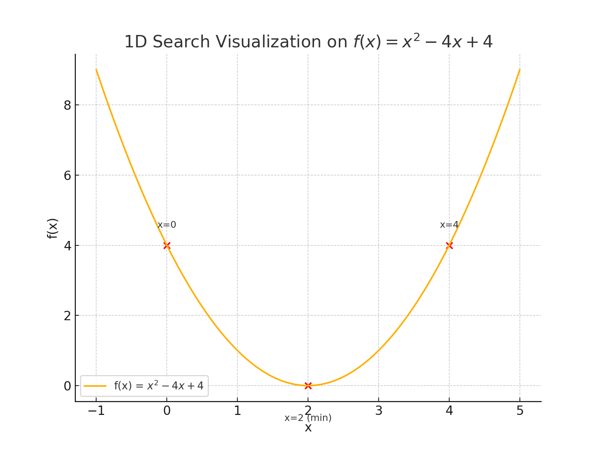

# 一维搜索（线性搜索）方法

## 定义
一维搜索（线性搜索）是一种在指定区间内寻找函数极值的优化算法。此方法适用于具有单一变量的函数。

## 数学表达和公式
设有函数 \( f: \mathbb{R} 
ightarrow \mathbb{R} \)，我们定义搜索区间为 \([a, b]\)。目标是在此区间找到 \( x^* \)，使得 \( f(x^*) \) 为该区间内的极值。

迭代公式如下：
\[
x_{n+1} = x_n + lpha_n \cdot d_n
\]
其中，\( lpha_n \) 为步长，\( d_n \) 为搜索方向。

## 图形表示
图形展示了函数 \( f(x) = x^2 - 4x + 4 \) 在区间 \([-1, 5]\) 上的一维搜索过程。通过迭代调整 \( x \)，搜索极小值点。

## 实际应用
一维搜索广泛应用于工程、科学研究和经济学中的优化问题。
